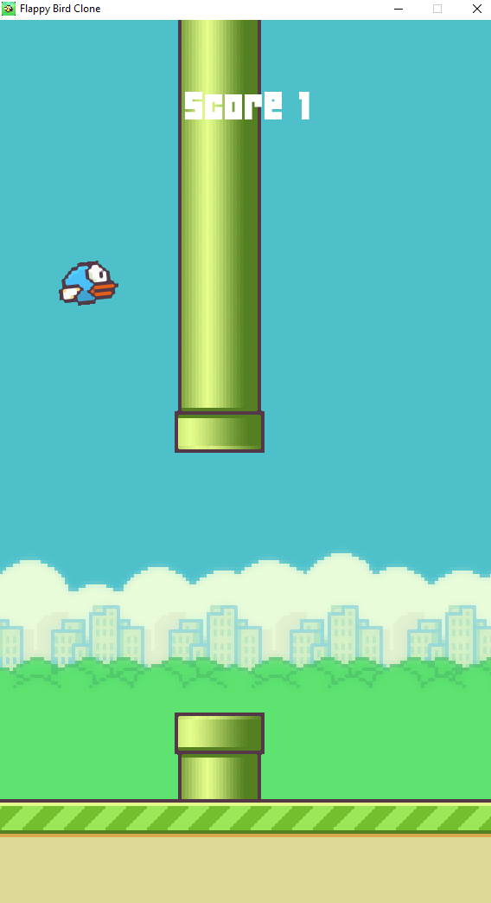

# Flappy Bird Clone

The game is clone of famous android game "Flappy Bird". 

**Flappy Bird** is a mobile game developed by Vietnamese video game artist and programmer Dong Nguyen, under his game development company dotGears. The game is a side-scroller where the player controls a bird, attempting to fly between columns of green pipes without hitting them.

The game is created for learning purpose only. The repository can be cloned and be played in your computer.

There are 2 themes which are randomly selected at the beginning of the game.
- Day
- Night

There are 3 bird colors which are also randomly selected at the beginning of the game.
- Blue
- Red
- Yellow

There are 2 color pipes which are randomly selected at the beginning of the game.
- Red
- Green

The games tracks score for the current gameplay and high score for the current session.

# Gameplay screenshots

# Instructions
- [Watch the video](https://www.youtube.com/channel/UCaytXdmsBMc-g8VwQNVMoCg) for installation and gameplay.

# Credits
Please checkout the below link for detail tutorial.
https://www.youtube.com/watch?v=UZg49z76cLw

I thank **Clear code** youtube channel for great tutorial on introduction to game development using pygame.

Link to the original image files: 
https://github.com/samuelcust/flappy-bird-assets

Link to the sound files: 
https://www.sounds-resource.com/mobile/flappybird/sound/5309/

